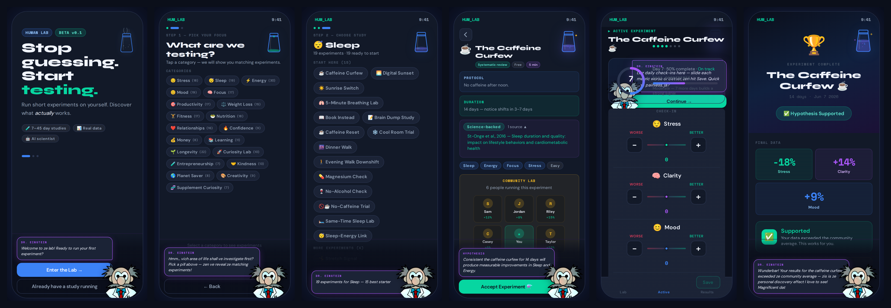
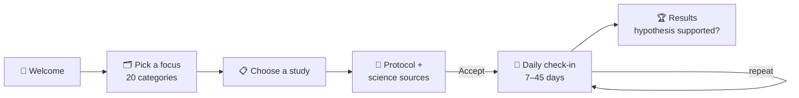
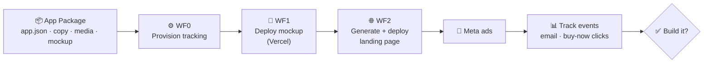

<div align="center">

# 🧪 Human Lab

**Stop guessing. Start testing.**

Run short, science-backed experiments on yourself. Pick a category, follow a structured 7 to 45 day study, check in daily, and find out what actually works for your stress, sleep, energy and habits, with a mad-scientist AI guide in your corner.


</div>

> **🧪 Sandbox:** This repo is a rehearsal copy of [Human-Lab](https://github.com/scootero/Human-Lab), used to test **WF1 (mockup deploy)** in the [App Validation System](https://github.com/scootero/App-Validation-System) from start to finish. It also contains the generated media assets (icon, logo, OG image and ad creative).

---

## 📸 Interactive Mockup

A clickable, phone-framed prototype of the full user journey:

<p align="center">
  
</p>

<p align="center"><sub>Welcome → Pick a focus → Choose a study → Experiment protocol → Daily check-in → Results</sub></p>

## ✨ Highlights

- **290 curated experiments** across 20 categories, including Stress, Sleep, Energy, Focus, Fitness, Nutrition and Longevity
- **Science-backed protocols.** Each study links to peer-reviewed sources.
- **Daily check-ins** with sliders for stress, clarity and mood
- **Clear results.** See the before and after change, whether your hypothesis held up, and how you compare with the community average.
- **Dr. Einstein.** An animated mascot guide with section tours, a flask that fills up as you progress, and confetti.

## 🔄 User journey



## 🏭 Part of the App Validation System

This repo is an **App Package**: one `app.json` manifest plus copy, media and a mockup. It feeds an automated n8n pipeline that tests demand for the app before any iOS code gets written.



---

## 📦 App Package Details

Reference implementation of an [App Package](https://github.com/app-validation-spec/app-validation-spec) for the automated app validation system.

**appId:** `human-lab`  
**status:** `draft`  
**specVersion:** `1.3.0`

### Folder layout

```txt
human-lab/
├── app.json              # Canonical manifest (required)
├── README.md             # This file
├── package.json          # Root wrapper for mockup dev commands
├── copy/                 # Landing page markdown (hero, features, faq)
├── docs/                 # Internal research (not used by landing generator)
├── media/                # Icons, OG image, screenshots (paths in app.json)
└── mockup/               # Interactive prototype source (React + Vite)
```

Internal folder names are **generic and reusable**—future App Packages use the same structure regardless of framework (record framework in `app.json` → `mockup.framework` only).

### Quick start

From this directory:

```bash
npm install
npm run dev
npm run build
```

The root `package.json` delegates to `mockup/` via `--prefix mockup`. Do not commit `mockup/node_modules/` or `mockup/dist/`.

### Landing page vs mockup

- **Mockup:** Built and deployed separately from `mockup/`. n8n writes `deployment.mockup.url` (and syncs `mockup.previewUrl`) after deploy.
- **Landing page:** Generated from `app.json`, `copy/`, and `media/`. Embeds the deployed mockup URL—it never imports mockup source directly.

### Automation placeholders

These fields exist in `app.json` but are `null` until n8n runs:

| Field | Set by |
|-------|--------|
| `tracking.webhookUrl` | Provisioning workflow (required before `ready`) |
| `deployment.mockup.url` | Mockup deploy workflow |
| `deployment.mockup.vercelProjectId` | Mockup deploy workflow |
| `deployment.landing.url` | Landing page deploy workflow (ad destination) |
| `deployment.landing.vercelProjectId` | Landing page deploy workflow |
| `deployment.landing.deploymentUrl` | Landing page deploy workflow |

Legacy `tracking.webhooks.emailCaptured` and `tracking.webhooks.buyNowClicked` are optional fallbacks when `tracking.webhookUrl` is not set.

Future pipeline: `draft` → `provisioning` → `ready` → validate → deploy mockup → generate landing config → deploy landing → ads → track events (`eventType`) → analytics (Sheets).

### Draft → provisioning → ready checklist

Before setting `status` to `provisioning`:

1. Add real files under `media/` matching paths in `app.json` (especially `media/screenshots/*.png`)
2. Complete `experiment`, `ads`, and `analytics` sections in `app.json`
3. Validate against `schemas/app.schema.json` (Phase 2 validator)
4. Confirm mockup builds locally with `npm run build`

Before setting `status` to `ready`:

1. `tracking.webhookUrl` must be provisioned by n8n

### Related docs

- [app-validation-spec/APP_PACKAGE_SPEC.md](../../app-validation-spec/APP_PACKAGE_SPEC.md)
- [docs/README.md](docs/README.md) — internal research
- [media/README.md](media/README.md) — asset checklist
- [mockup/README.md](mockup/README.md) — prototype dev and deploy

---

<div align="center">

Built by **[Scott Oliver](https://github.com/scootero)**

</div>
